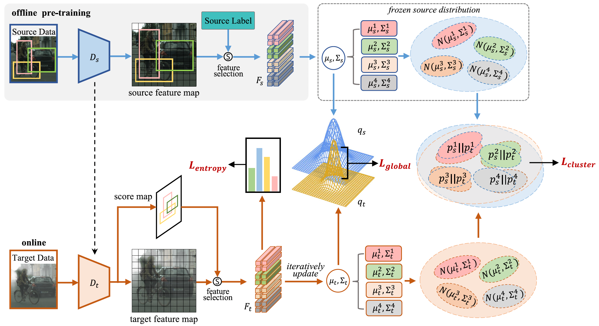

# [MLFA: Toward Realistic Test Time Adaptive Object Detection by Multi-Level Feature Alignment](https://ieeexplore.ieee.org/abstract/document/10713112)

## 💡 Preparation

#### Datasets
Prepare required benchmark datasets following [DATASET.md](./docs/DATASETS.md). Almost all popular DAOD benchmarks are supported in this project.

#### Installation
```
conda create -n mlfa python=3.7
conda activate mlfa
pip install -r requirements.txt
python setup.py build develop
```

## 🔥 Get Start
```
CUDA_VISIBLE_DEVICES=0 python tools/train_net_da.py --config-file configs/sim10k_to_city_vgg16.yaml
```

## 📝 Citation 

If you think this work is helpful for your project, please give it a star and citation. We sincerely appreciate for your acknowledgments.

```BibTeX  
@article{liu2024mlfa,
  title={MLFA: Towards Realistic Test Time Adaptive Object Detection by Multi-level Feature Alignment},
  author={Liu, Yabo and Wang, Jinghua and Huang, Chao and Wu, Yiling and Xu, Yong and Cao, Xiaochun},
  journal={IEEE Transactions on Image Processing},
  year={2024},
  publisher={IEEE}
}
```

## 🤞 Acknowledgements 
We mainly appreciate for these good projects and their authors' hard-working.
- This work is based on [SIGMA](https://github.com/CityU-AIM-Group/SIGMA). 
- The implementation of our anchor-free detector is from [FCOS](https://github.com/tianzhi0549/FCOS/tree/f0a9731dac1346788cc30d5751177f2695caaa1f), which highly relies on [maskrcnn-benchmark](https://github.com/facebookresearch/maskrcnn-benchmark).
- The feature alignment is from [TTAC](https://github.com/Gorilla-Lab-SCUT/TTAC).

## 📒 Abstract
Object detection methods have achieved remarkable performances when the training and testing data satisfy the assumption of i.i.d. However, the training and testing data may be collected from different domains, and the gap between the domains can significantly degrade the detectors. Test Time Adaptive Object Detection (TTA-OD) is a novel online approach that aims to adapt detectors quickly and make predictions during the testing procedure. TTA-OD is more realistic than the existing unsupervised domain adaptation and source-free unsupervised domain adaptation approaches. For example, self-driving cars need to improve their perception of new environments in the TTA-OD paradigm during driving. To address this, we propose a multi-level feature alignment (MLFA) method for TTA-OD, which is able to adapt the model online based on the steaming target domain data. For a more straightforward adaptation, we select informative foreground and background features from image feature maps and capture their distributions using probabilistic models. Our approach includes: i) global-level feature alignment to align all informative feature distributions, thereby encouraging detectors to extract domain-invariant features, and ii) cluster-level feature alignment to match feature distributions for each category cluster across different domains. Through the multi-level alignment, we can prompt detectors to extract domain-invariant features, as well as align the category-specific components of image features from distinct domains. We conduct extensive experiments to verify the effectiveness of our proposed method.



